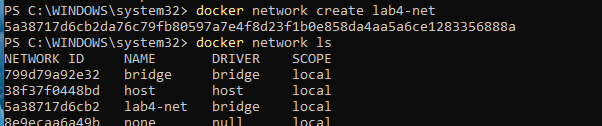
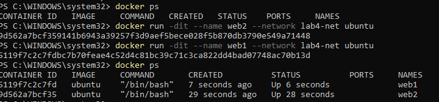
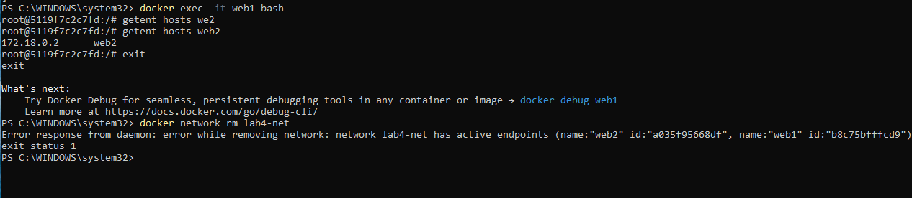
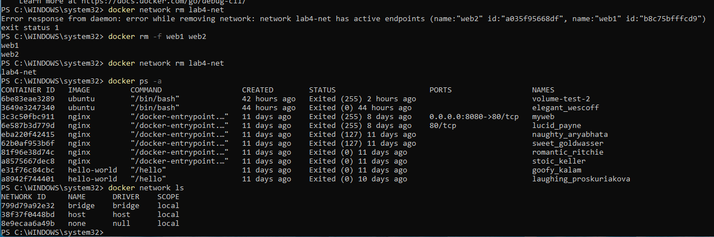

# Docker Lab 04 - Networking and Container Communication

## Objective

Learn how Docker networks allow containers to communicate with each other using container names and Docker DNS.

---

## Skills Practiced

* Creating Docker networks
* Listing Docker networks
* Inspecting Docker networks
* Connecting containers to a custom network
* Docker DNS name resolution
* Troubleshooting Docker networking
* Removing containers and networks

---

## Environment

* Windows 10 Host
* Docker Desktop
* Ubuntu Containers

---

## Step 1 - View Existing Networks

List the available Docker networks:

```powershell
docker network ls
```

Output included the default Docker networks:

* bridge
* host
* none

---

## Step 2 - Create a Custom Network

Created a custom bridge network:

```powershell
docker network create lab4-net
```

Verified the network:

```powershell
docker network ls
```

---

## Step 3 - Create Containers on the Network

Created two Ubuntu containers connected to the custom network:

```powershell
docker run -dit --name web1 --network lab4-net ubuntu

docker run -dit --name web2 --network lab4-net ubuntu
```

Verified both containers were running:

```powershell
docker ps
```

---

## Step 4 - Enter Container and Test Name Resolution

Entered the first container:

```powershell
docker exec -it web1 bash
```

Used Docker DNS to resolve the second container:

```bash
getent hosts web2
```

Output:

```text
172.18.0.2 web2
```

This proved that:

* web1 could find web2
* Docker DNS was functioning correctly
* Both containers were attached to the same network

---

## Step 5 - Attempt to Remove the Network

Attempted to remove the network:

```powershell
docker network rm lab4-net
```

Docker returned:

```text
network lab4-net has active endpoints
```

This occurred because:

* web1 was still attached
* web2 was still attached

Docker prevents deletion of networks that are currently in use.

---

## Step 6 - Remove Containers and Network

Removed the containers:

```powershell
docker rm -f web1 web2
```

Removed the network:

```powershell
docker network rm lab4-net
```

Verified cleanup:

```powershell
docker ps -a

docker network ls
```

---

## Key Concepts Learned

### Docker Network

A Docker network provides communication between containers.

### Bridge Network

The default network type used by Docker containers.

### Docker DNS

Containers connected to the same Docker network can resolve each other by container name.

Example:

```text
web1
  ↓
lab4-net
  ↓
web2
```

Instead of using IP addresses directly, containers can communicate using container names.

### Active Endpoints

A network cannot be deleted while containers are attached to it.

Containers must be removed or disconnected before deleting the network.

---

## Screenshots

### Network Creation



### Containers Connected



### Docker DNS Resolution



### Network Cleanup



---

## What I Learned

In this lab I learned how Docker networks provide communication between containers. I created a custom bridge network, connected multiple containers to it, verified name resolution using Docker DNS, and learned why Docker prevents deleting networks that are still in use. This lab reinforced the importance of troubleshooting through observation, verification, and evidence-based problem solving.

