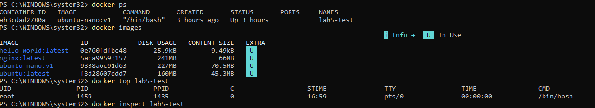
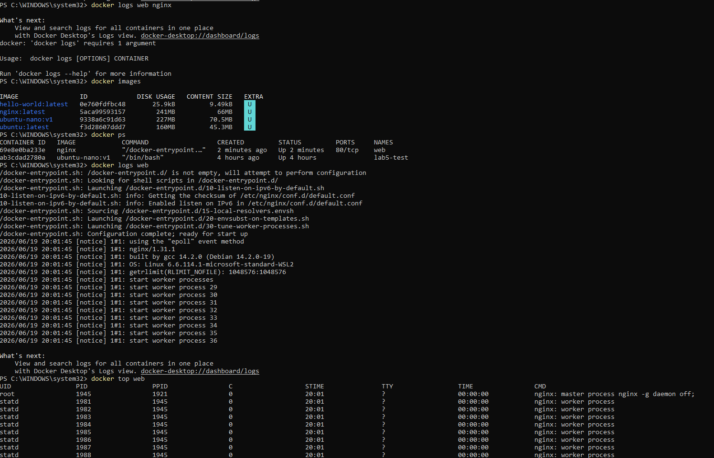
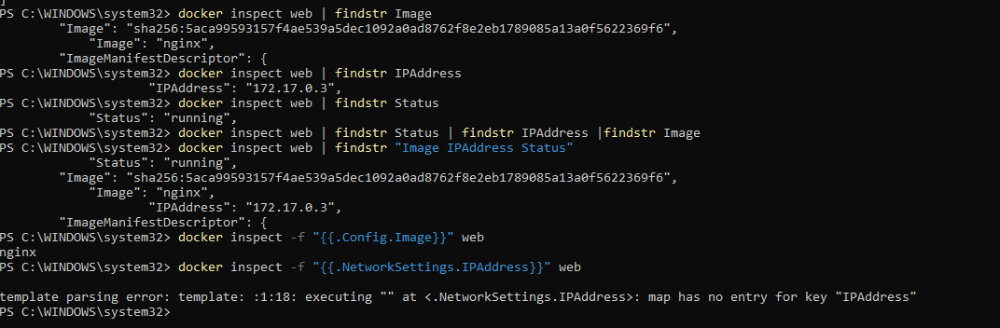
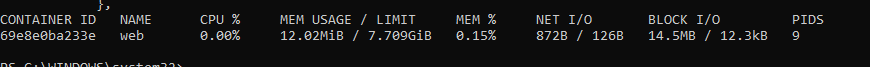
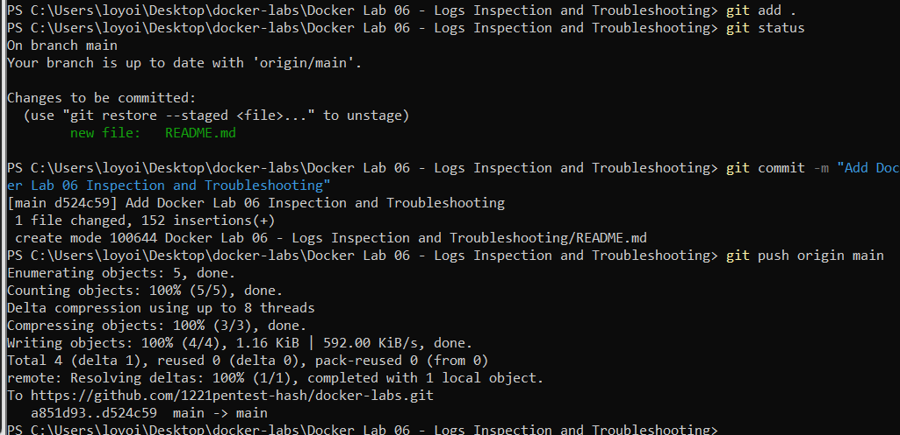

# Docker Lab 06 - Logs, Inspection and Troubleshooting

## Objective

Learn how to troubleshoot Docker containers using logs, process inspection, container inspection, and resource monitoring.

---

## Commands Used

### Show Running Containers

```powershell
docker ps
```

Purpose:

Display active containers.

---

### View Container Logs

```powershell
docker logs web
```

Purpose:

Display messages generated by the container's main process.

Key Observation:

- Ubuntu container running bash produced almost no logs.
- Nginx container produced startup and configuration logs.

---

### View Running Processes

```powershell
docker top web
```

Purpose:

Display processes running inside a container.

Key Observation:

```text
nginx master process
nginx worker process
nginx worker process
```

Nginx runs multiple processes.

---

### Inspect Container Configuration

```powershell
docker inspect web
```

Purpose:

Display detailed container information.

Information Found:

- Image: nginx
- IP Address: 172.17.0.3
- Status: running

---

### Filter Output

```powershell
docker inspect web | findstr Image
docker inspect web | findstr IPAddress
docker inspect web | findstr Status
```

Purpose:

Display only specific information.

Lesson:

The pipe operator `|` sends output from one command to another.

---

### Monitor Resource Usage

```powershell
docker stats web
```

Purpose:

Display CPU and memory usage in real time.

---

## Troubleshooting Workflow

1. Verify container is running

```powershell
docker ps
```

2. Check logs

```powershell
docker logs <container>
```

3. Check running processes

```powershell
docker top <container>
```

4. Inspect configuration

```powershell
docker inspect <container>
```

5. Check resource usage

```powershell
docker stats <container>
```

---

## Key Lessons Learned

- Installed software is not the same as a running process.
- Bash generated almost no logs because it was idle.
- Nginx generated logs because it actively performs work.
- Docker inspect provides detailed container information.
- Docker top shows running processes.


## Screenshots

### Docker Container Inspection



---

### Nginx Logs



---

### Nginx Container Inspection



---

### Docker Resource Monitoring



---

### Git Commit and Push




- Docker stats shows resource usage.
- Troubleshooting is based on evidence, not assumptions.