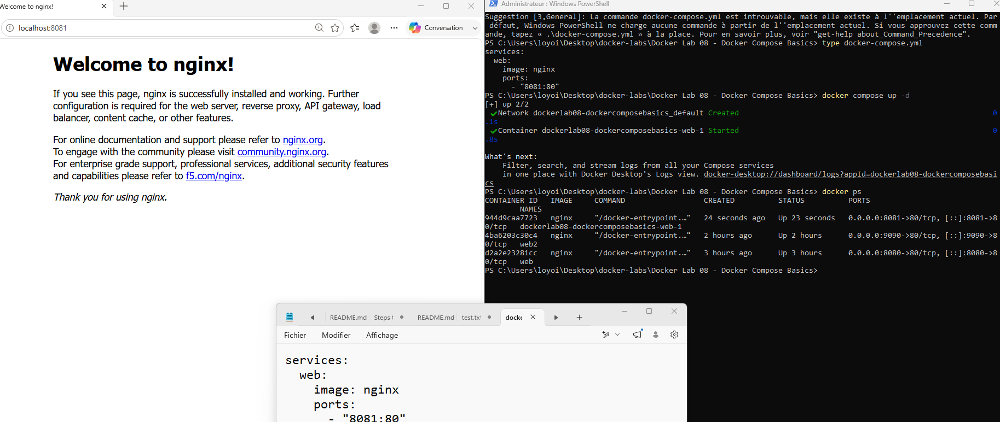
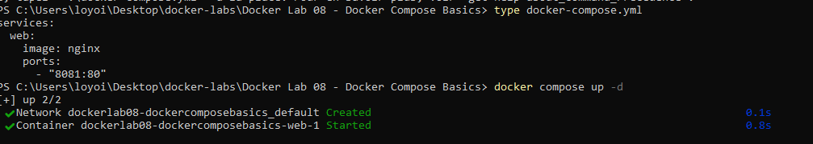
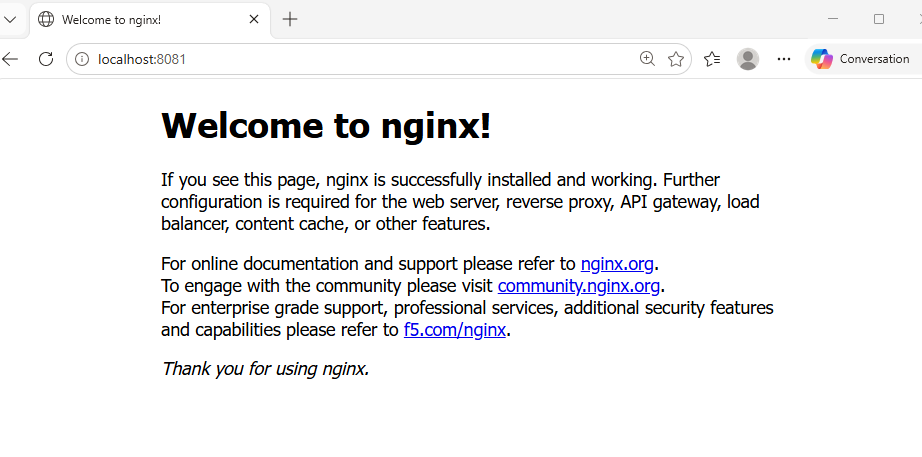
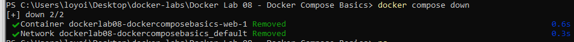
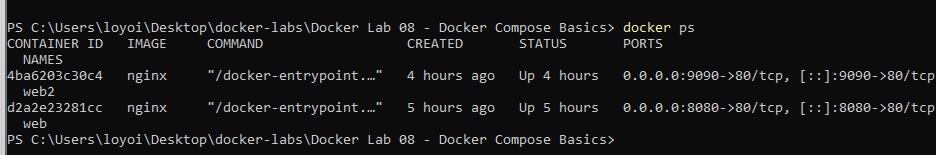

# Docker Lab 08 - Docker Compose Basics

## Objective

Learn how to use Docker Compose to deploy and manage containers using a YAML configuration file instead of manually creating containers with Docker CLI commands.

---

## Environment

* Windows 11
* Docker Desktop
* PowerShell
* Docker Compose v5.1.4

---

## Docker Compose File

### docker-compose.yml

```yaml
services:
  web:
    image: nginx
    ports:
      - "8081:80"
```

### Explanation

| Setting      | Description                               |
| ------------ | ----------------------------------------- |
| services     | Defines the containers managed by Compose |
| web          | Service name                              |
| image: nginx | Uses the official Nginx image             |
| ports        | Defines port mapping                      |
| 8081:80      | Host Port 8081 → Container Port 80        |

---

## Commands Used

### Verify Docker Compose

```powershell
docker compose version
```

### Display Compose File

```powershell
type docker-compose.yml
```

### Deploy Services

```powershell
docker compose up -d
```

### Verify Running Containers

```powershell
docker ps
```

### Stop and Remove Services

```powershell
docker compose down
```

---

## Results

Docker Compose successfully:

* Created a Docker network automatically
* Created an Nginx container automatically
* Assigned a project-based container name
* Published Nginx on port 8081
* Removed the container and network when the project was stopped

---

## Container Information

### Generated Container Name

```text
dockerlab08-dockercomposebasics-web-1
```

### Generated Network

```text
dockerlab08-dockercomposebasics_default
```

---

## Browser Test

### URL

```text
http://localhost:8081
```

### Result

```text
Welcome to nginx!
```

The Nginx web server was successfully accessed through the mapped host port.

---

## Concepts Learned

### Infrastructure as Code

Instead of manually creating containers:

```powershell
docker run -d --name web -p 8080:80 nginx
```

Docker Compose allows infrastructure to be defined in a YAML file and deployed using:

```powershell
docker compose up -d
```

---

### Port Mapping

```yaml
ports:
  - "8081:80"
```

Meaning:

```text
Host Port      = 8081
Container Port = 80
```

Users connect to the host port while Nginx listens on the container port.

---

### Automatic Container Naming

Docker Compose automatically generates container names using:

```text
Project-Service-Instance
```

Example:

```text
dockerlab08-dockercomposebasics-web-1
```

---

### Automatic Network Creation

Docker Compose automatically creates a dedicated network for the project:

```text
dockerlab08-dockercomposebasics_default
```

This network is automatically removed when:

```powershell
docker compose down
```

is executed.

---

## Screenshots

### Compose File



### Display Compose File



### Running Containers


### Nginx Browser Test



### Docker Compose Down



### Verification After Removal



---

## Troubleshooting Notes

### Why did Docker Compose create a long container name?

Docker Compose automatically generates names to avoid conflicts between projects.

Example:

```text
dockerlab08-dockercomposebasics-web-1
```

This naming format allows multiple Compose projects to run simultaneously.

---

### Why did docker compose down not remove my other containers?

Docker Compose only manages containers defined in the current project's compose file.

Containers created outside the project remain untouched.

Example:

```text
web
web2
```

continued running after:

```powershell
docker compose down
```

---

## Skills Practiced

* Docker Compose
* YAML Configuration
* Infrastructure as Code
* Container Deployment
* Container Lifecycle Management
* Docker Networking
* Port Mapping
* Nginx Deployment
* Docker CLI
* PowerShell
* Troubleshooting
* Technical Documentation

---

## Key Takeaway

Docker Compose allows infrastructure to be described in a YAML file and managed with simple commands:

```powershell
docker compose up -d

docker compose down
```

This approach is faster, repeatable, and easier to maintain than manually creating containers with individual Docker commands.


This approach is easier to maintain, reproduce, and scale than manually creating containers with individual Docker commands.


