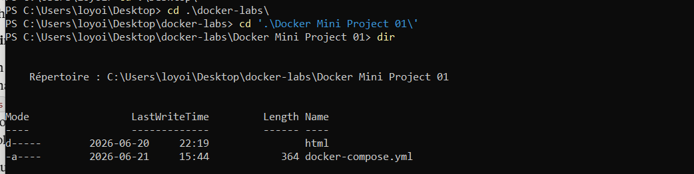
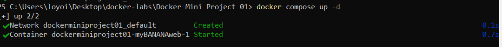
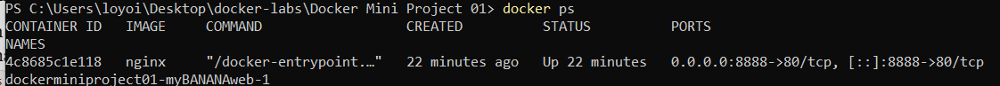
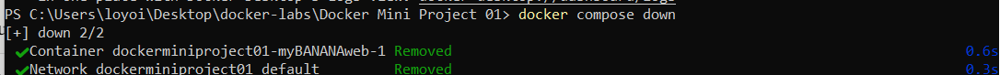
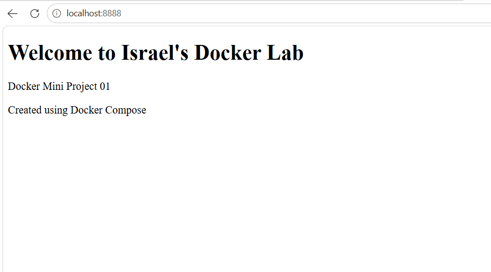
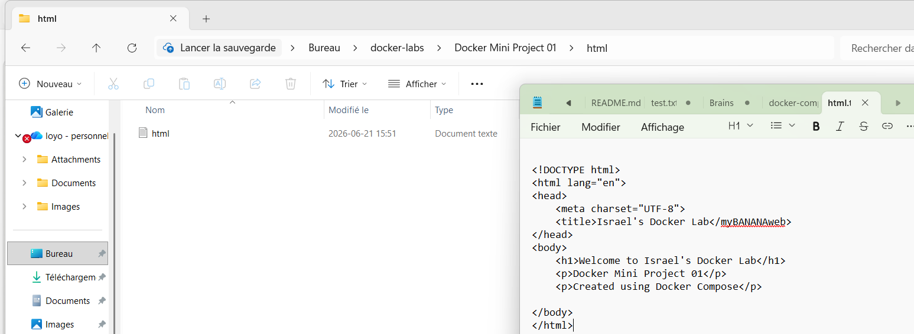

# Docker Mini Project 01 — Personal Web Server

A Docker Compose project that deploys a custom Nginx web server, overriding the default welcome page with a personalized HTML page using a volume mount.

## Overview

This lab demonstrates the fundamentals of containerized web services using Docker Compose:

- Deploying an Nginx container from the official image
- Defining the entire setup declaratively in `docker-compose.yml` (no `docker run` commands)
- Mapping a host port to a container port
- Using a bind mount to serve custom content instead of Nginx's default page
- Verifying, tearing down, and restarting the stack to confirm persistence

## Project Structure

```
Docker Mini Project 01/
│
├── docker-compose.yml
│
├── html/
│   └── index.html
│
└── Screenshots/
```

## docker-compose.yml

```yaml
services:
  myBANANAweb:
    image: nginx
    ports:
      - "8888:80"
    volumes:
      - ./html:/usr/share/nginx/html
```

**Key concepts:**

| Directive | Purpose |
|---|---|
| `image: nginx` | Pulls the official Nginx image rather than building a custom one |
| `ports: "8888:80"` | Maps host port `8888` to Nginx's default internal port `80` |
| `volumes: ./html:/usr/share/nginx/html` | Mounts the local `html` folder onto Nginx's web root, overriding the default page with custom content |

## How to Run

```bash
# From inside the project folder
docker compose up -d

# Confirm the container is running
docker ps

# Visit in browser
http://localhost:8888

# Tear down
docker compose down
```

## Screenshots

### 1. Folder Structure


### 2. `docker compose up -d`


### 3. `docker ps`


### 4. `docker compose down`


### 5. HTML Folder Contents
.png)

### 6. Custom Page in Browser


## Troubleshooting Log

This lab didn't work on the first try — here's what went wrong and how it was diagnosed and fixed, since the debugging is as much a part of the lab as the working result.

### Issue 1: YAML indentation error

**Symptom:** `docker compose up` failed with `yaml: while parsing a block mapping... did not find expected key`.

**Cause:** The `volumes:` key was indented at the same level as the service name instead of nested under it, so Compose read it as a second, invalid service.

**Fix:** Re-indented the file so `volumes:` sat at the same level as `image:` and `ports:`, properly nested inside the `myBANANAweb` service.

### Issue 2: Absolute Windows path with backslashes and spaces

**Symptom:** Volume mount wasn't resolving correctly.

**Cause:** The original path used backslashes (`\`) and was missing the container-side path and proper quoting.

**Fix:** Switched to a relative path (`./html:/usr/share/nginx/html`), which is shorter, avoids Windows path issues entirely, and keeps the project portable.

### Issue 3: 403 Forbidden — hidden file extension

**Symptom:** After fixing the YAML and confirming the container was running with the volume mounted, the browser showed a `403 Forbidden` error instead of the custom page or the Nginx default.

**Diagnosis:** Inspected the mounted folder directly inside the running container:

```bash
docker exec -it dockerminiproject01-myBANANAweb-1 ls -la /usr/share/nginx/html
```

Output revealed the file was actually named `index.html.txt`, not `index.html` — Windows Explorer hides known file extensions by default, so renaming the file in the GUI silently kept the original `.txt` extension instead of replacing it.




**Fix:** Enabled file extensions in Windows Explorer settings and renamed the file to a true `index.html`. Since the folder is a live bind mount, Nginx picked up the correctly named file immediately — no container restart required.

## Bonus Challenge: Persistence Test

```bash
docker compose down
docker compose up -d
```

Result: the custom page loaded immediately on refresh with no further changes needed, because the bind mount points directly at files on the host machine rather than a copy baked into the image — nothing is lost when the container is removed and recreated.

**Result: PASS**

## Key Takeaways

- Bind mounts (`volumes:`) keep content live and editable from the host, independent of the container's lifecycle.
- YAML is whitespace-sensitive; indentation errors fail loudly but aren't always obvious from the error message alone.
- `docker exec` into a running container is the fastest way to verify what a container can actually see on disk, cutting through assumptions about file paths and naming.
- Windows hides file extensions by default, which is a common source of "phantom" bugs when renaming files through Explorer.
