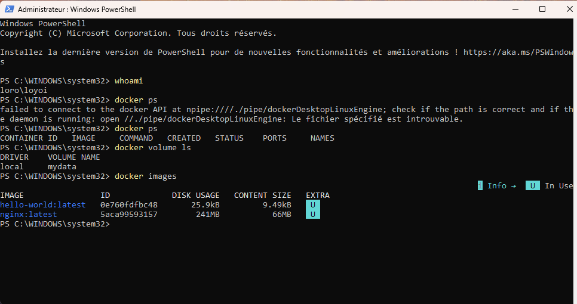
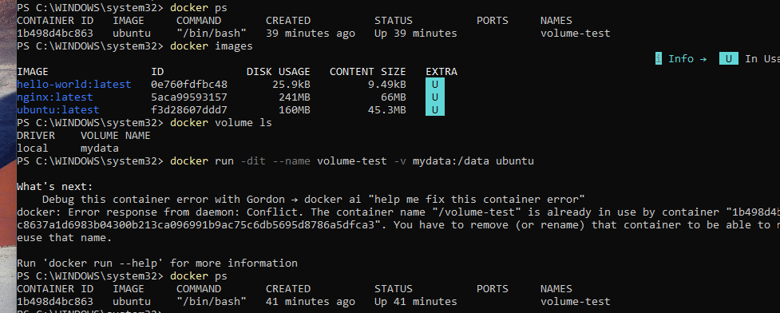
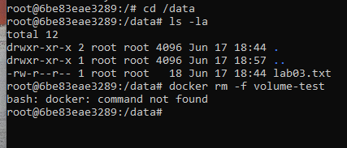

# Docker Lab 03 – Volumes and Persistent Storage

## Objective

Learn how Docker volumes provide persistent storage that survives container deletion.

---

## Skills Practiced

* Creating Docker volumes
* Listing Docker volumes
* Attaching volumes to containers
* Entering containers with Docker Exec
* Linux navigation
* Creating files inside mounted volumes
* Deleting containers
* Verifying data persistence

---

## Environment

Host OS:

* Windows 11

Container Image:

* Ubuntu Latest

Docker Volume:

* mydata

Container Names:

* volume-test
* volume-test-2

---

## Commands Used

### Create Volume

```powershell
docker volume create mydata
```

### Verify Volume

```powershell
docker volume ls
```

### Download Ubuntu Image

```powershell
docker pull ubuntu
```

### Create Container With Volume

```powershell
docker run -dit --name volume-test -v mydata:/data ubuntu
```

### Enter Container

```powershell
docker exec -it volume-test bash
```

### Verify Current Location

```bash
pwd
```

### Navigate To Volume

```bash
cd /data
```

### List Files

```bash
ls -la
```

### Create Test File

```bash
echo "Sensei Ops Lab 03" > lab03.txt
```

### Read File

```bash
cat lab03.txt
```

### Remove Container

```powershell
docker rm -f volume-test
```

### Create New Container Using Same Volume

```powershell
docker run -dit --name volume-test-2 -v mydata:/data ubuntu
```

---

## Results

A file named lab03.txt was created inside the Docker volume.

The original container was deleted.

A new container was created and connected to the same volume.

The file remained available, proving that Docker volumes provide persistent storage independent of containers.

---

## Key Concepts Learned

Image

* Blueprint used to create containers

Container

* Temporary running instance

Volume

* Persistent storage that survives container deletion

Docker Exec

* Allows access to a running container

Persistent Storage

* Data remains available even after containers are destroyed and recreated

---

## Lessons Learned

The most important lesson from this lab is that application containers should be treated as temporary resources.

Business data should be stored in Docker volumes rather than inside the container filesystem.

This allows containers to be recreated without losing important data.

---

## Outcome

Successfully demonstrated Docker persistent storage using volumes and verified that data survives container deletion and recreation.


## Screenshots

### Docker Volume


### Docker Images




### Container Creation




### File Stored In Volume


### File Survived In New Container




