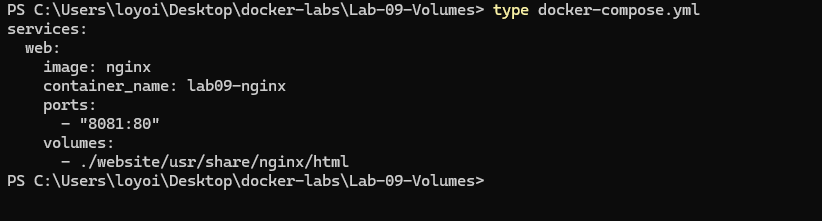
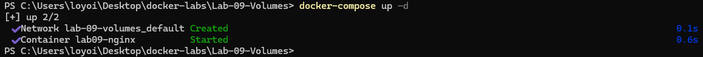
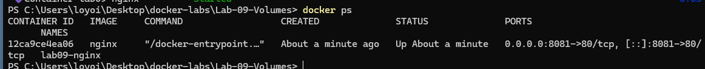
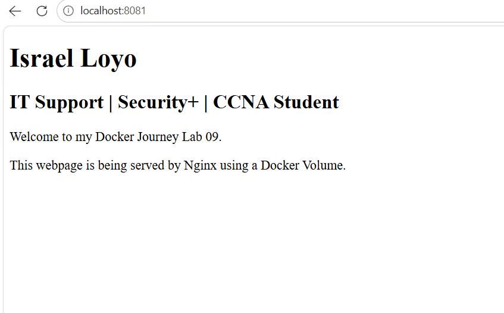
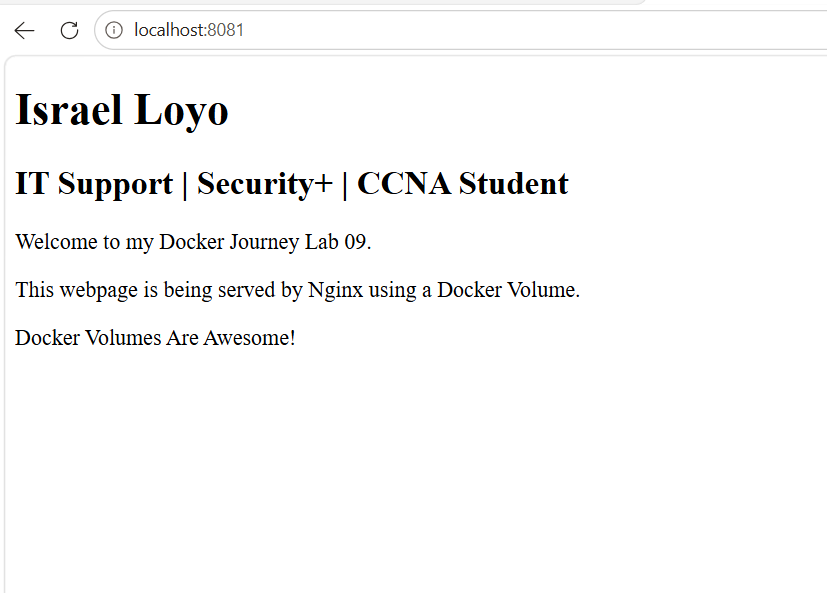

# Docker Lab 09 - Docker Volumes

## Objective

Learn how Docker Volumes allow files stored on the host machine to be mounted inside a container, providing persistent storage and real-time file synchronization.

---

## Environment

* Windows 11
* Docker Desktop
* PowerShell
* Docker Compose
* Nginx

---

## Folder Structure

```text
Lab-09-Volumes
│
├── docker-compose.yml
├── README.md
│
├── screenshots
│   ├── 01-compose-file.png
│   ├── 02-docker-compose-up.png
│   ├── 03-docker-ps.png
│   ├── 04-custom-website.png
│   ├── 05-volume-test.png
│
└── website
    └── index.html
```

---

## Docker Compose File

### docker-compose.yml

```yaml
services:
  web:
    image: nginx
    container_name: lab09-nginx
    ports:
      - "8081:80"
    volumes:
      - ./website:/usr/share/nginx/html
```

---

## Volume Explanation

```yaml
volumes:
  - ./website:/usr/share/nginx/html
```

| Path                  | Description                         |
| --------------------- | ----------------------------------- |
| ./website             | Folder on the host computer         |
| /usr/share/nginx/html | Nginx web root inside the container |

This volume allows Nginx to serve files directly from the local website folder.

---

## Commands Used

### Display Compose File

```powershell
type docker-compose.yml
```

### Start Container

```powershell
docker compose up -d
```

### Verify Running Container

```powershell
docker ps
```

### Stop Container

```powershell
docker compose down
```

---

## Results

Docker successfully:

* Created an Nginx container
* Published port 8081
* Mounted the local website folder
* Served a custom HTML page
* Reflected changes immediately after editing the HTML file

---

## Browser Test

URL:

```text
http://localhost:8081
```

Result:

```text
Israel Loyo
IT Support | Security+ | CCNA Student
```

The custom webpage was successfully served by Nginx.

---

## Volume Test

The following line was added to the HTML file:

```html
<p>Docker Volumes Are Awesome!</p>
```

After saving the file and refreshing the browser:

* No container restart was required
* No Docker Compose commands were required
* Changes appeared immediately

This confirms that the Docker Volume is functioning correctly.

---

## Concepts Learned

### Volumes

Volumes allow data to persist outside the container.

```text
Host Folder
     │
     ▼
Docker Volume
     │
     ▼
Container
```

Data remains available even if the container is recreated.

---

### Persistent Storage

Containers are generally ephemeral.

Volumes provide persistent storage for:

* Websites
* Databases
* Configuration files
* Application data

---

### Real-Time Synchronization

Changes made to files on the host machine are immediately available inside the container.

Example:

```text
website/index.html
```

is mapped to:

```text
/usr/share/nginx/html/index.html
```

inside the Nginx container.

---

## Screenshots

### Compose File



### Docker Compose Up



### Running Container



### Custom Website



### Volume Test



---

## Troubleshooting

### Volume Mount Error

Initial configuration:

```yaml
- ./website: /usr/share/nginx/html
```

Result:

```text
invalid mount path
mount path must be absolute
```

Cause:

A space existed after the colon.

Incorrect:

```yaml
- ./website: /usr/share/nginx/html
```

Correct:

```yaml
- ./website:/usr/share/nginx/html
```

This issue prevented Docker from mounting the volume.

---

## Skills Practiced

* Docker Compose
* Docker Volumes
* Nginx Deployment
* YAML Configuration
* Port Mapping
* Persistent Storage
* Volume Mounting
* Troubleshooting
* PowerShell
* Technical Documentation

---

## Key Takeaway

Docker Volumes provide persistent storage and allow files stored on the host machine to be accessed directly from containers.

This makes development faster because changes can be tested immediately without recreating containers.
