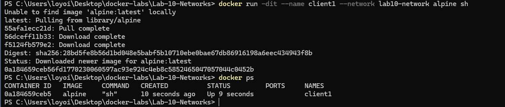
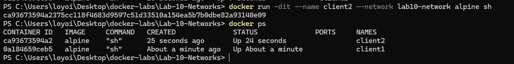
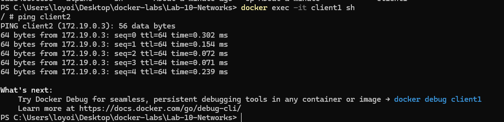
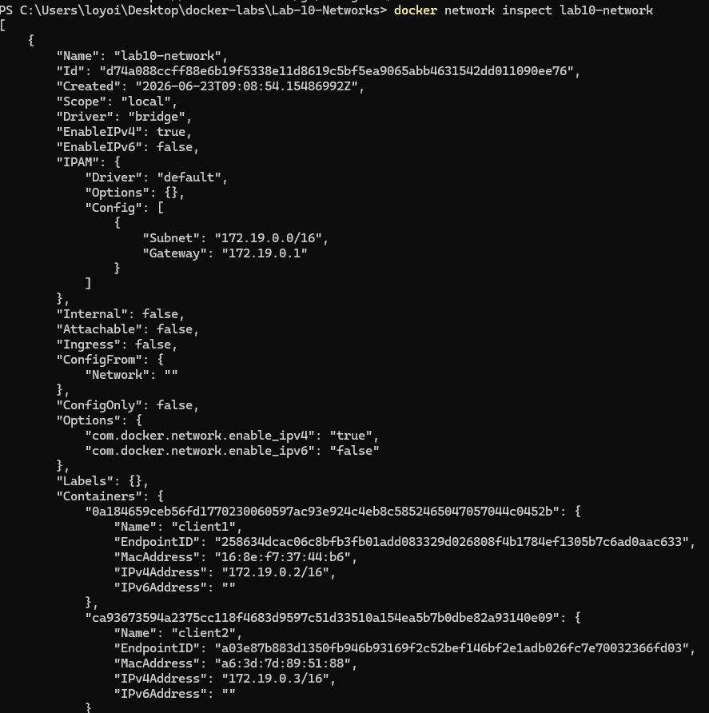
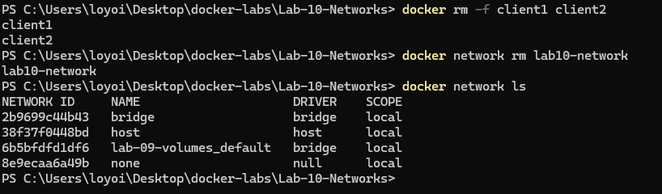

# Docker Lab 10 - Docker Networks

## Objective

Learn how Docker Networks allow containers to communicate with each other using custom bridge networks and Docker DNS resolution.

---

## Environment

* Windows 11
* Docker Desktop
* PowerShell
* Alpine Linux Containers

---

## Commands Used

### List Existing Networks

```powershell
docker network ls
```

### Create Custom Network

```powershell
docker network create lab10-network
```

### Create Container 1

```powershell
docker run -dit --name client1 --network lab10-network alpine sh
```

### Create Container 2

```powershell
docker run -dit --name client2 --network lab10-network alpine sh
```

### Verify Containers

```powershell
docker ps
```

### Access Container

```powershell
docker exec -it client1 sh
```

### Test Connectivity

```sh
ping client2
```

### Inspect Network

```powershell
docker network inspect lab10-network
```

### Remove Containers

```powershell
docker rm -f client1 client2
```

### Remove Network

```powershell
docker network rm lab10-network
```

---

## Results

Docker successfully:

* Created a custom bridge network
* Connected multiple containers to the network
* Assigned IP addresses automatically
* Provided automatic DNS resolution
* Allowed container-to-container communication

---

## Network Topology

```text
+---------+
| client1 |
+---------+
     |
     |
     v
+---------------+
| lab10-network |
+---------------+
     ^
     |
     |
+---------+
| client2 |
+---------+
```

---

## DNS Resolution Test

From inside client1:

```sh
ping client2
```

Result:

```text
PING client2 (172.19.0.3)
```

Docker automatically resolved the container name to its IP address without manually configuring DNS.

---

## Network Inspection

Docker network inspection displayed:

```text
client1
172.19.0.2

client2
172.19.0.3
```

Both containers were attached to the custom bridge network.

---

## Concepts Learned

### Docker Networks

Docker Networks allow containers to communicate securely.

### Bridge Networks

A bridge network creates an isolated communication environment between containers.

### DNS Resolution

Docker automatically provides DNS resolution between containers on the same network.

Example:

```text
client1 → client2
```

instead of:

```text
client1 → 172.19.0.3
```

### Network Inspection

Docker provides detailed network information using:

```powershell
docker network inspect
```

---

## Command Reference

### View Existing Networks

```powershell
docker network ls
```

Purpose:

* Displays all Docker networks
* Shows network driver and scope

### Create Custom Network

```powershell
docker network create lab10-network
```

Purpose:

* Creates a custom bridge network
* Allows container-to-container communication

### Verify Network Creation

```powershell
docker network ls
```

Purpose:

* Confirms the network was successfully created

### Create Client1 Container

```powershell
docker run -dit --name client1 --network lab10-network alpine sh
```

Purpose:

* Creates a lightweight Alpine Linux container
* Connects it to the custom network

### Create Client2 Container

```powershell
docker run -dit --name client2 --network lab10-network alpine sh
```

Purpose:

* Creates a second container
* Connects it to the same network

### Verify Running Containers

```powershell
docker ps
```

Purpose:

* Displays running containers
* Verifies both containers are active

### Access Container Shell

```powershell
docker exec -it client1 sh
```

Purpose:

* Opens an interactive shell inside client1

### Test Network Connectivity

```sh
ping client2
```

Purpose:

* Tests communication between containers
* Verifies Docker DNS resolution

### Inspect Network

```powershell
docker network inspect lab10-network
```

Purpose:

* Displays detailed network information
* Shows connected containers
* Shows assigned IP addresses

### Remove Containers

```powershell
docker rm -f client1 client2
```

Purpose:

* Force removes both containers

### Remove Network

```powershell
docker network rm lab10-network
```

Purpose:

* Deletes the custom network

### Verify Cleanup

```powershell
docker network ls
```

Purpose:

* Confirms the network was removed

---

## Screenshots

### Existing Networks


### Custom Network Created


### Client1 Running



### Two Containers Running



### Connectivity Test



### Network Inspection



### Cleanup



---

## Troubleshooting Notes

### Alpine Image Not Found

Issue:

```text
Unable to find image 'alpine:latest' locally
```

Cause:

The Alpine image was not downloaded yet.

Resolution:

Docker automatically downloaded the image from Docker Hub.

Result:

```text
Status: Downloaded newer image for alpine:latest
```

---

### Docker DNS Verification

Test:

```sh
ping client2
```

Result:

```text
PING client2 (172.19.0.3)
```

This confirmed that Docker DNS was functioning correctly.

---

### Screenshot Rendering Problem

Issue:

Screenshots were not displaying in GitHub even though the image files existed inside the screenshots folder.

Cause:

The README contained malformed Markdown formatting, including:

* Unclosed code blocks
* Escaped Markdown characters
* Corrupted formatting from previous edits

Resolution:

A minimal test README was created to verify image rendering. The images displayed successfully, confirming that the screenshot paths were correct.

The README was then rebuilt using clean Markdown formatting.

Lesson Learned:

```text
1. Verify the image exists
2. Verify Git tracks the file
3. Verify the image path
4. Test with a minimal README
5. Isolate the root cause
```

---

### Network Verification

Command:

```powershell
docker network inspect lab10-network
```

Purpose:

* Verify connected containers
* Verify assigned IP addresses
* Troubleshoot communication issues

---

## Skills Practiced

* Docker Networks
* Bridge Networks
* DNS Resolution
* Container Communication
* Network Inspection
* Troubleshooting
* Linux Containers
* Docker CLI
* Technical Documentation

---

## Key Takeaway

Docker Networks allow containers to communicate using container names instead of IP addresses, simplifying service discovery and multi-container deployments.
