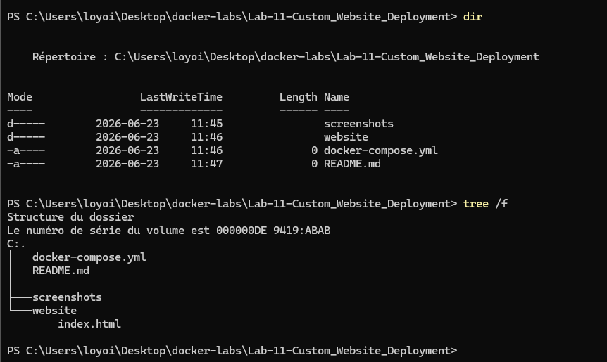
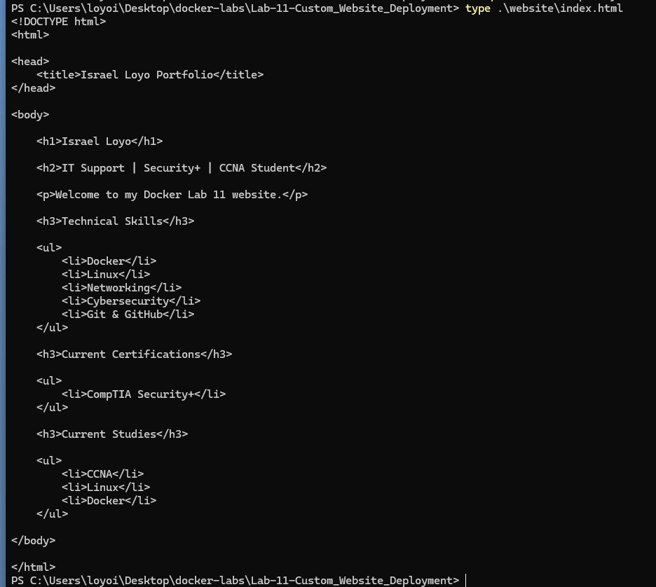
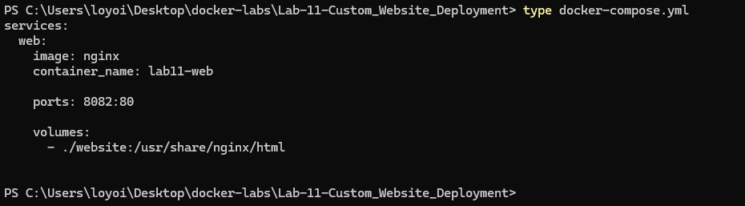
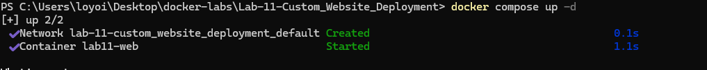
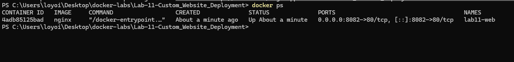
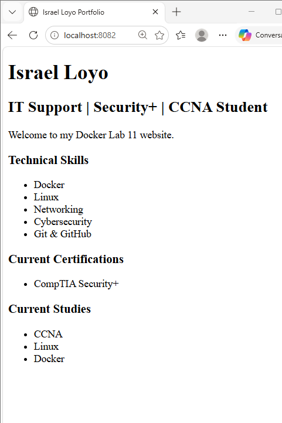
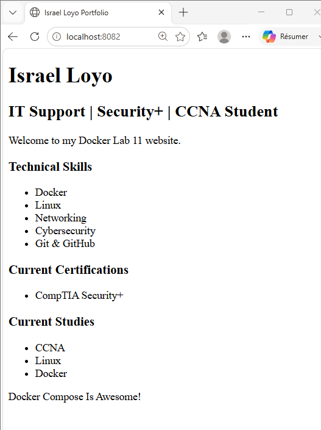
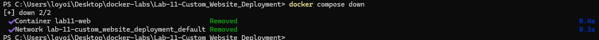

# Docker Lab 11 - Custom Website Deployment


## Objective


Deploy a custom HTML website using Nginx, Docker Compose, and bind mounts.


This lab demonstrates how developers can edit files locally while Docker serves the updated content immediately.


---


## Environment


- Windows 11

- Docker Desktop

- PowerShell

- Nginx

- Docker Compose

- HTML


---


## Project Structure


```text

Lab-11-Custom\_Website\_Deployment

│

├── docker-compose.yml

├── README.md

│

├── screenshots

│

└── website

&#x20;   └── index.html

```


---


## Commands Used


### Verify Folder Structure


```powershell

tree /f

```


### View HTML File


```powershell

type .\\website\\index.html

```


### View Docker Compose File


```powershell

type docker-compose.yml

```


### Deploy Application


```powershell

docker compose up -d

```


### Verify Running Container


```powershell

docker ps

```


### Stop Deployment


```powershell

docker compose down

```


---


## Docker Compose Configuration


```yaml

services:

&#x20; web:

&#x20;   image: nginx

&#x20;   container\_name: lab11-web


&#x20;   ports:

&#x20;     - "8082:80"


&#x20;   volumes:

&#x20;     - ./website:/usr/share/nginx/html

```


---


## Results


Docker successfully:


- Created an isolated network

- Started an Nginx container

- Mapped port 8082 to port 80

- Mounted the local website folder

- Served a custom HTML website

- Reflected file changes immediately


---


## Volume Synchronization Test


The following line was added to the HTML file:


```html

<p>Docker Compose Is Awesome!</p>

```


After saving the file and refreshing the browser, the update appeared immediately.


No container restart was required.


This confirms the bind mount was functioning correctly.


---


## Concepts Learned


### Docker Compose


Docker Compose allows applications to be defined as code using YAML.


Example:


```yaml

services:

&#x20; web:

&#x20;   image: nginx

```


---


### Port Mapping


```yaml

ports:

&#x20; - "8082:80"

```


Meaning:


```text

Host Port      = 8082

Container Port = 80

```


Users connect to:


```text

http://localhost:8082

```


---


### Bind Mounts

```yaml
volumes:
  - ./website:/usr/share/nginx/html
```

Meaning:

```text
Host Folder
     │
     ▼
website
     │
     ▼
Nginx Container
     │
     ▼
Browser
```

Changes on the host are instantly visible inside the container.

---

## Screenshots

### Folder Structure



### HTML File



### Docker Compose File



### Docker Compose Deployment



### Running Container



### Browser Test



### Live Update Test



### Deployment Removal



---


Changes on the host are instantly visible inside the container.


---


## Troubleshooting Notes


### Docker Compose YAML Error


Issue:


```text

services.web.ports must be a array

```


Cause:


Incorrect YAML syntax.


Incorrect:


```yaml

ports: "8082:80"

```


Correct:


```yaml

ports:

&#x20; - "8082:80"

```


Lesson:


Docker Compose expects ports to be defined as a list.


---


### Volume Mount Verification


Test:


Added:


```html

<p>Docker Compose Is Awesome!</p>

```


Result:


The webpage updated immediately after refreshing the browser.


Conclusion:


The bind mount was functioning correctly.


---


### Container Verification


Command:


```powershell

docker ps

```


Purpose:


- Verify container status

- Verify container name

- Verify port mapping


---


## Skills Practiced


- Docker Compose

- Docker Volumes

- Bind Mounts

- Nginx

- HTML

- YAML

- Port Mapping

- Container Deployment

- Troubleshooting

- Technical Documentation


---


## Key Takeaway


Docker Compose simplifies application deployment by defining infrastructure in a YAML file.


Bind mounts allow developers to edit files locally while containers serve the updated content immediately, creating an efficient development workflow.

