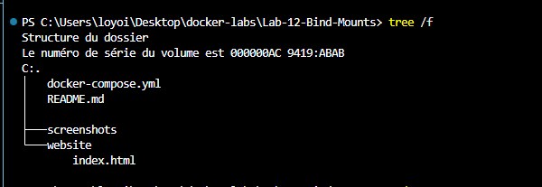
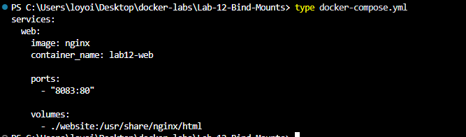
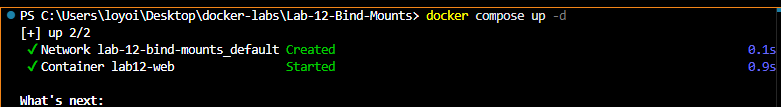
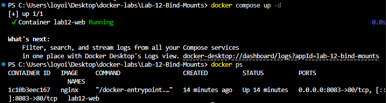
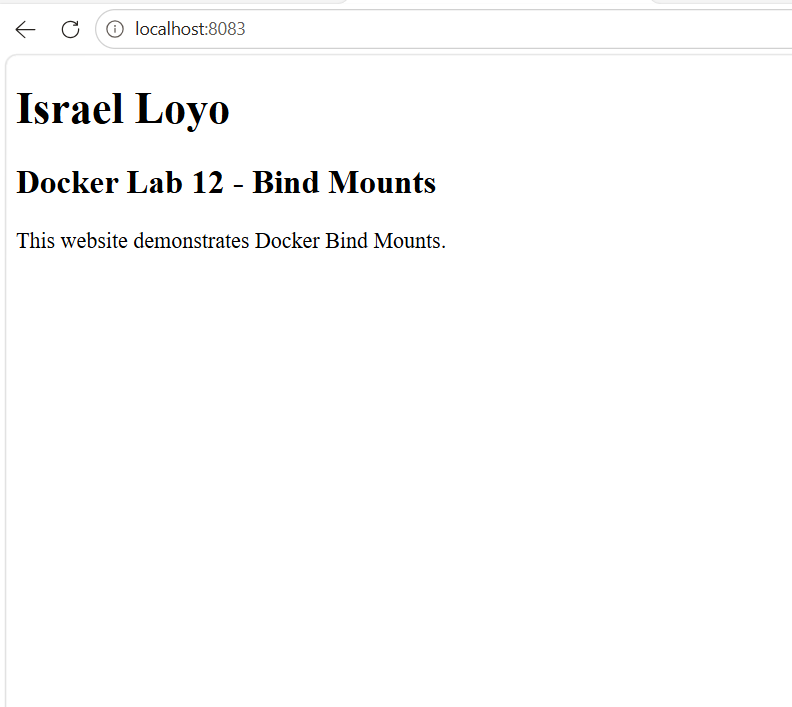
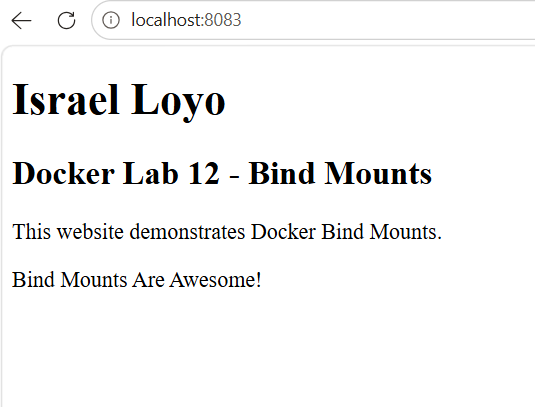

# Docker Lab 12 - Bind Mounts

## Objective

Learn how Docker Bind Mounts allow files on the host machine to be mounted directly into a container.

This lab demonstrates real-time synchronization between the host system and a running container.

---

## Environment

- Windows 11
- Docker Desktop
- PowerShell
- Docker Compose
- Nginx
- HTML

---

## Project Structure

```text
Lab-12-Bind-Mounts
│
├── docker-compose.yml
├── README.md
│
├── screenshots
│
└── website
    └── index.html
```

---

## Commands Used

### Verify Folder Structure

```powershell
tree /f
```

### View HTML File

```powershell
type .\website\index.html
```

### View Docker Compose File

```powershell
type docker-compose.yml
```

### Deploy Application

```powershell
docker compose up -d
```

### Verify Running Container

```powershell
docker ps
```

### Stop Deployment

```powershell
docker compose down
```

---

## Docker Compose Configuration

```yaml
services:
  web:
    image: nginx
    container_name: lab12-web

    ports:
      - "8083:80"

    volumes:
      - ./website:/usr/share/nginx/html
```

---

## Results

Docker successfully:

- Created a container from the Nginx image
- Created a default Docker network
- Mapped port 8083 to port 80
- Mounted the website folder into the container
- Served the custom HTML website
- Reflected file changes immediately

---

## Bind Mount Test

Initial website:

```html
<p>This website demonstrates Docker Bind Mounts.</p>
```

Added:

```html
<p>Bind Mounts Are Awesome!</p>
```

After refreshing the browser, the change appeared immediately.

No container restart was required.

This confirms the bind mount was functioning correctly.

---

## Concepts Learned

### Bind Mounts

```yaml
volumes:
  - ./website:/usr/share/nginx/html
```

Meaning:

```text
Host Folder
     │
     ▼
website
     │
     ▼
Docker Container
     │
     ▼
Nginx Web Server
     │
     ▼
Browser
```

Changes made on the host are instantly visible inside the container.

---

### Port Mapping

```yaml
ports:
  - "8083:80"
```

Meaning:

```text
Host Port      = 8083
Container Port = 80
```

Users connect through:

```text
http://localhost:8083
```

---

### Docker Compose

Docker Compose allows infrastructure to be defined as code using YAML.

Example:

```yaml
services:
  web:
    image: nginx
```

---

## Screenshots

### Folder Structure



### HTML File


### Docker Compose File



### Container Created



### Running Container



### Browser Test



### Bind Mount Update



### Compose Down


---

## Troubleshooting Notes

### YAML Formatting Error

Possible Issue:

```text
services.web.ports must be a array
```

Cause:

Incorrect YAML formatting.

Incorrect:

```yaml
ports: "8083:80"
```

Correct:

```yaml
ports:
  - "8083:80"
```

Lesson:

Docker Compose expects ports to be defined as a list.

---

### Bind Mount Not Updating

Possible Issue:

Changes do not appear in the browser.

Verification:

```powershell
docker ps
```

Check:

- Container is running
- Browser is refreshed
- File was saved

---

### Port Already In Use

Possible Issue:

```text
Bind for 0.0.0.0:8083 failed
```

Cause:

Another application is already using port 8083.

Resolution:

Use another port:

```yaml
ports:
  - "8084:80"
```

---

## Skills Practiced

- Docker Compose
- Bind Mounts
- Nginx
- HTML
- YAML
- Port Mapping
- Container Deployment
- Troubleshooting
- Technical Documentation

---

## Key Takeaway

Bind Mounts create a direct connection between files on the host machine and files inside a container.

This allows developers to modify files locally and see changes immediately without rebuilding or restarting containers.