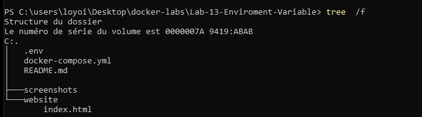
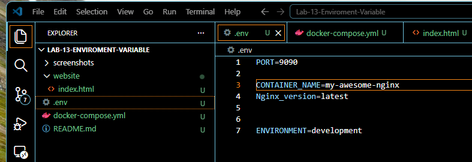
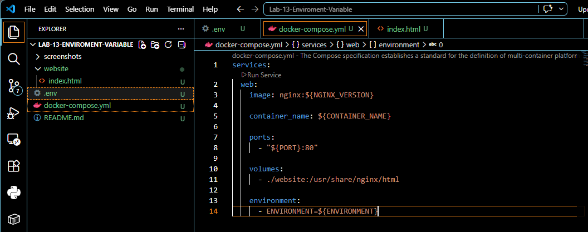
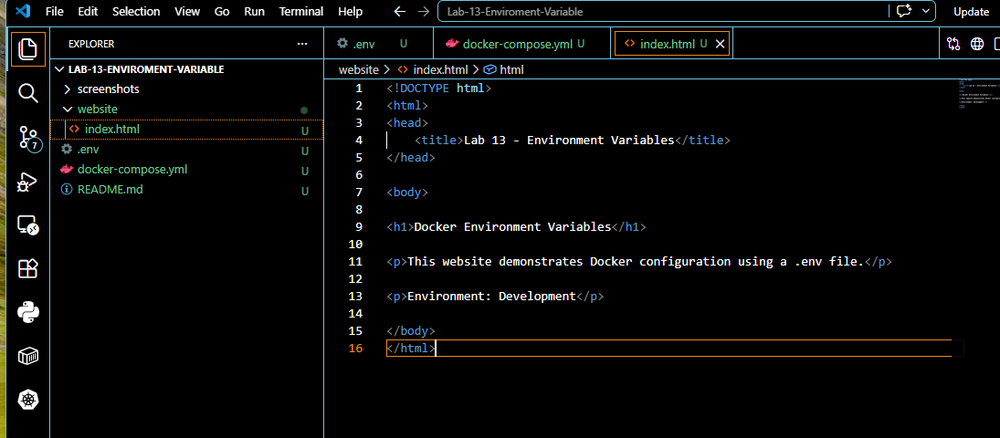
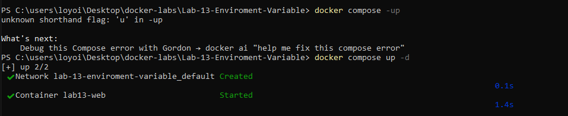
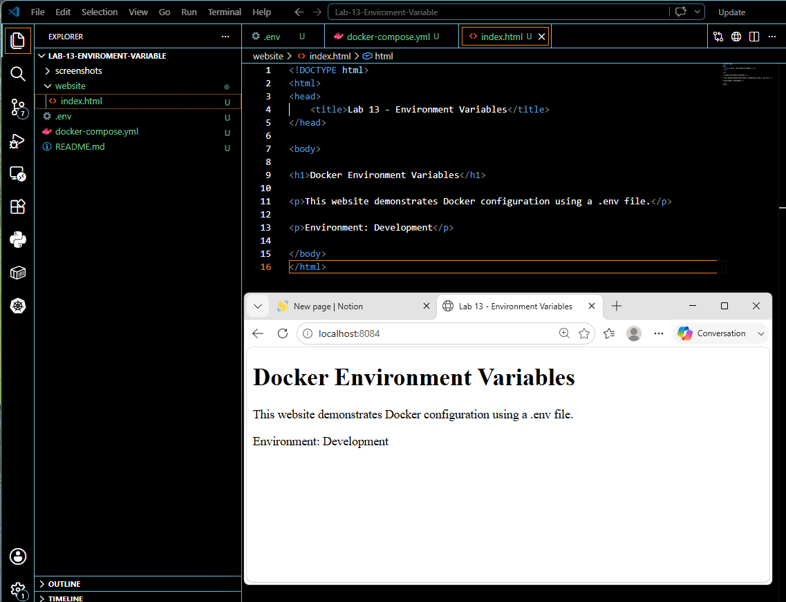
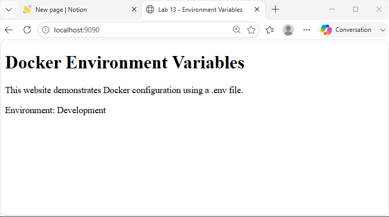
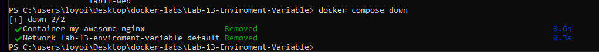

# Docker Lab 13 - Environment Variables

## Objective

Learn how Docker Compose uses **Environment Variables** stored in a `.env` file to separate configuration from the application.

This lab demonstrates how configuration can be modified without changing the Docker Compose file.

---

# Environment

- Windows 11
- Docker Desktop
- PowerShell
- Docker Compose
- Nginx
- HTML
- Visual Studio Code

---

# Project Structure

```
Lab-13-Environment-Variables
│
├── .env
├── docker-compose.yml
├── README.md
│
├── screenshots
│
└── website
    └── index.html
```

---

# Commands Used

## Verify Folder Structure

```powershell
tree /f
```

## Deploy Application

```powershell
docker compose up -d
```

## Verify Running Container

```powershell
docker ps
```

## Stop Deployment

```powershell
docker compose down
```

---

# .env Configuration

```text
PORT=8084
CONTAINER_NAME=lab13-web
NGINX_VERSION=latest
ENVIRONMENT=Development
```

---

# Docker Compose Configuration

```yaml
services:
  web:
    image: nginx:${NGINX_VERSION}

    container_name: ${CONTAINER_NAME}

    ports:
      - "${PORT}:80"

    volumes:
      - ./website:/usr/share/nginx/html

    environment:
      - ENVIRONMENT=${ENVIRONMENT}
```

---

# Results

Docker successfully:

- Created an Nginx container
- Loaded values from the `.env` file
- Assigned the custom container name
- Mapped the configured port
- Mounted the website folder
- Served the HTML page successfully

---

# Environment Variable Test

Initial configuration:

```
PORT=8084
CONTAINER_NAME=lab13-web
```

Modified configuration:

```
PORT=9090
CONTAINER_NAME=my-awesome-nginx
```

After restarting the deployment:

- Container name changed successfully
- Port changed successfully
- No modifications were made to `docker-compose.yml`

This demonstrates the separation of configuration from application logic.

---

# Concepts Learned

## Environment Variables

Environment variables allow configuration values to be stored outside the application.

Examples include:

- Ports
- Container names
- Image versions
- Database connections
- API Keys

---

## .env Files

The `.env` file stores configuration using:

```
KEY=value
```

Example:

```
PORT=8084
```

Docker Compose automatically loads these values.

---

## Variable Expansion

Docker Compose replaces variables automatically.

Example:

```yaml
container_name: ${CONTAINER_NAME}
```

Docker reads:

```
CONTAINER_NAME=lab13-web
```

Result:

```
container_name: lab13-web
```

---

# Skills Practiced

- Docker Compose
- Environment Variables
- .env Files
- Variable Expansion
- Port Mapping
- Bind Mounts
- Nginx
- HTML
- YAML
- Technical Documentation
- Troubleshooting

---

# Screenshots

## Project Structure



---

## .env File



---

## Docker Compose



---

## HTML File



---

## Docker Compose Up



---

## Initial Browser Test



---

## Updated Environment Variables


---

## Browser After Update



---

## Docker Compose Down



---

# Troubleshooting Notes

## Container Does Not Start

Possible causes:

- Incorrect variable name
- Missing `.env` file
- YAML formatting error

Verification:

```powershell
docker compose config
```

---

## Port Already In Use

Possible error:

```
Bind for 0.0.0.0 failed
```

Resolution:

Update the port inside:

```
.env
```

Example:

```
PORT=9091
```

---

## Variable Not Replaced

Possible cause:

Variable name mismatch.

Incorrect:

```
${container_name}
```

Correct:

```
${CONTAINER_NAME}
```

---

# Key Takeaway

Environment variables separate **configuration** from the application.

This allows the same Docker Compose project to be deployed across Development, Testing, and Production environments by changing only the `.env` file without modifying the application or infrastructure definition.